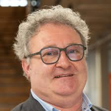
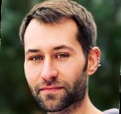
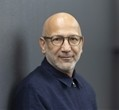

The **1st International Workshop on "Causal Learning and Reasoning in Agents and Multiagent Systems" (CLaRAMAS)**
is organised by 

<table>
    <tr>
        <td width="25%"></td>
        <td width="60%">Dr. <strong>Stefano Mariani</strong> 👋 
            <em>Department of Science and Methods of Engineering</em>   
            <em>University of Modena and Reggio Emilia</em>  
            Reggio Emilia, Italy</td>
        <td width="15%"> 🌐 <a href="https://smarianimore.github.io">website</a>   
            📫 <a href="mailto:stefano.mariani@unimore.it">email</a> </td>
    </tr>
    <tr>
        <td width="25%"></td>
        <td width="60%">Dr. <strong>André Meyer-Vitali</strong> 👋 
            <em>Deutsches Forschungszentrum für Künstliche Intelligenz GmbH</em>  
            Saarbrücken, Germany</td>
        <td width="15%"> 🌐 <a href="https://www.dfki.de/en/web/about-us/employee/person/anme08">website</a>   
            📫 <a href="mailto:andre.meyer-vitali@dfki.de">email</a> </td>
    </tr>
    <tr>
        <td width="25%"></td>
        <td width="60%">Dr. <strong>Julien Siebert</strong> 👋 
            <em>Data Science Department</em>  
            <em>Fraunhofer Institute for Experimental Software Engineering</em>  
            Kaiserslautern, Germany</td>
        <td width="15%"> 🌐 <a href="https://www.iese.fraunhofer.de/blog/author/julien-siebert/">website</a>   
            📫 <a href="mailto:julien.siebert@iese.fraunhofer.de">email</a> </td>
    </tr>
    <tr>
        <td width="25%"></td>
        <td width="60%">Prof. <strong>Mehdi Dastani</strong> 👋 
            <em>Department of Information and Computing Sciences</em>  
            <em>Utrecht University</em>  
            Utrecht, The Netherlands</td>
        <td width="15%"> 🌐 <a href="https://www.uu.nl/staff/MMDastani">website</a>   
            📫 <a href="mailto:m.m.dastani@uu.nl">email</a> </td>
    </tr>
</table>

The **Technical Program Committee** members are

| Franco Zambonelli | University of Modena and Reggio Emilia | Italy |
| Alessandro Ricci | University of Bologna | Italy |
| Ada Diaconescu | Telecom Paris | France |
| Roxana Rădulescu | Utrecht University | Netherlands |
| Gauthier Picard | École des Mines de Saint-Étienne | France |
| Chiara Boldrini | National Research Council | Italy |
| Mingxuan Li | Columbia University | US |
| Giuseppe Vizzari | University of Milano-Bicocca | Italy |
| Vahid Yazdanpanah | University of Southampton | UK |
| Sander Beckers | University College London | UK |
| Rodica G. Mihai | NORCE Energy | Norway |
| Onn Shehory | Bar Ilan University | Israel |
| Michael Thielscher | University of New South Wales | Australia |
| Ann Nowé | Vrije Universiteit Brussel | Belgium |
| Carles Sierra | Spanish National Research Council | Spain |
| Kristian Kersting | Technical University Darmstadt | Germany |
| Tom Lenaerts | Vrije Universiteit Brussel | Belgium |
| Rem Collier | University College Dublin | Ireland |
| Shihan Wang | Utrecht University | Netherlands |
| Nardine Osman | Spanish National Research Council | Spain |
| Wico Mulder | TNO | Netherlands |
| Sylvia Kerkhove | Utrecht University | Netherlands |
| Francisco N. F. Q. Simoes | Utrecht University | Netherlands |
| Giovanni Briglia | University of Modena and Reggio Emilia | Italy |
| Maksim Gladyshev | Utrecht University | Netherlands |
| Sven Koenig | University of California Irvine | USA |
